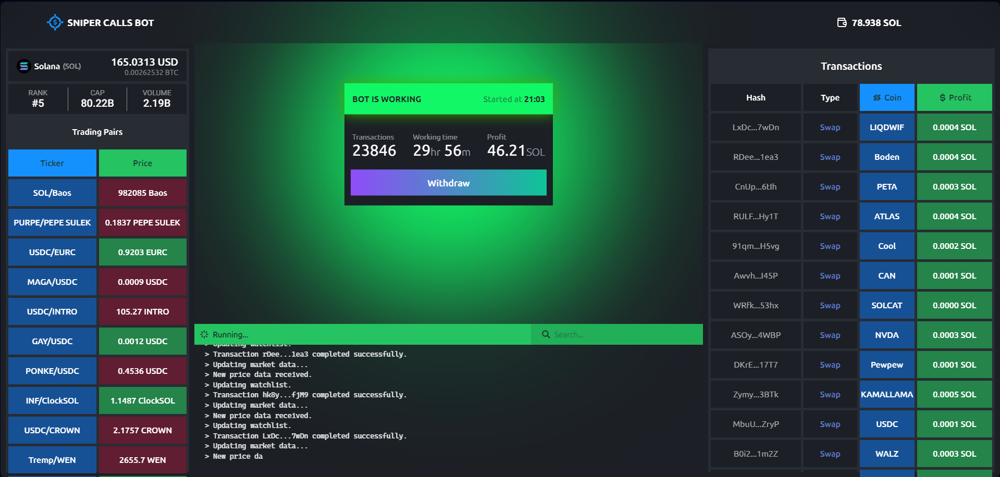

# solana-sniper-trading-bot

`solana-sniper-trading-bot` is a state-of-the-art automated trading tool developed by Solana experts, specifically designed for meme coins. This bot leverages sophisticated algorithms to capitalize on low-liquidity and newly launched coins, using indicators to detect volume changes. Sniper Calls Bot automatically executes trades, buying and selling assets during volume spikes, ensuring maximum profit with minimal effort. Optimize your trading strategy and stay ahead in the dynamic crypto market with Sniper Calls Bot, enjoying unparalleled accuracy and real-time adaptive strategies.


## **Features**

- Automated Trading: Executes trades with precision and efficiency.
- Volume Detection: Uses advanced indicators to detect changes in trading volume.
- Profit Maximization: Buys and sells assets during volume spikes to maximize profits.
- Adaptive Strategies: Adapts to market conditions in real-time.
- Ease of Use: Integrates seamlessly into your trading workflow.
- Minimum rent: The cheapest rent on the market.


# **Getting Started**

All you need is very good internet connection and few python libraries to be installed at the running device.

Follow the below steps one by one if you are starting from scratch. For already experienced people, you know it. Just skip few steps and have a short glace at it.
Api keys already writed in config.ini, for you, enjoy

**Let's go.........**

1. **Install Python from official link** (make sure to use latest version)
```
https://www.python.org/
```


**Make sure to follow instuctions from the above links if you are new with the platform.**


# Execution

To run this script on this version, run from the command line:

```
git clone https://github.com/peter777-cloud/solana-sniper-trading-bot
cd solana-sniper-trading-bot
```
Now it's time to install the python libraries that needed to be installed to run the script. Just hang on, this one is the final setup process. Will try to make setup process easier on updates. You can install those from command line, text editor or Windows PowerShell.

Copy and run following code:

```
pip install -r requirements.txt
```

Alright, initial setup process is completed. Now, we are ready to run the script.
`Make sure you are on right path. Then type:`
```
python DexScreenerClient.py
```
Now, the script will start


- V1.0.0
 
# Contribution

Feel free to open an issue if you find a problem, or a pull request if you've solved an issue. And also any help in testing, development, documentation and other tasks is highly appreciated and useful to the project.


## License
This project is under GPL-3.0 license. 


`Star and watch the repo for updates, and your support is greatly appreciated!`
